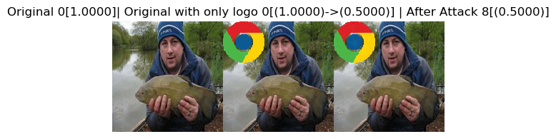
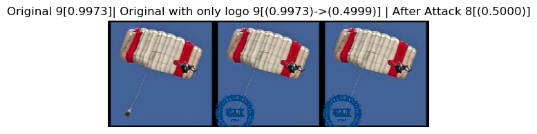
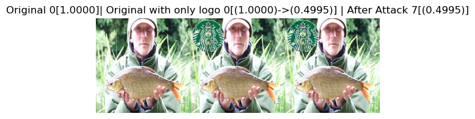

## Introduction
  관련 연구를 통해서 일반적으로 적대적인 이미지가 adversarial 알고리즘으로서 이미지 전체 영역에 교란이 추가되어 이미지가 자연스럽지 못한 경우가 발생한 문제점 있다. 그래서 그리고 deepfool 알고리즘으로서 교란을 최소화를 하는데 적대적 이미지가 가끔씩 좀 자연스럽지 못한다. 그래서 교란의 구역에 제한하면서 복잡한 로고의 비 투명 영역에 교란을 추가하고 분류 네트워크 오작동 분류하 도록 한다.
  
장점: 1. 로고의 비 투명 영역에 교란을 잘 숨길 수 있다. 2.일반적으로 사람들은 로고가 부착된 사진에 이상함을 느끼지 않으며, 이미지에 DFlogo를 자연스럽게 삽입하여 분류 네트워크를 속일 수 있음을 보여준다.

## Preparation
* **Attacked model:** Mobilenet_v2 ([Link](http://s0pytorch0org.icopy.site/hub/pytorch_vision_mobilenet_v2/))
* **Dataset:** [Download](https://onedrive.live.com/?authkey=%21AI8PYpczYU9HSN0&id=81DD74CEC613B8E4%21363509&cid=81DD74CEC613B8E4))
* **Logo:** Google chrome，Starbucks, 한양대학교 로고
* **References:** ([Link](https://www.cv-foundation.org/openaccess/content_cvpr_2016/papers/Moosavi-Dezfooli_DeepFool_A_Simple_CVPR_2016_paper.pdf))
* **Pytorch** ([Instructions](https://pytorch.org/get-started/locally/))
* **NumPy** ([Instructions](https://scipy.org/install.html))
* **Matplotlib** ([Instructions](https://matplotlib.org/))

## Description
  (1)먼저 공격에 사용될 로고의 크기는 50*50이며, Google chrome, Starbucks,한양대학교의 마크를 DFlogo로 사용하였다. 로고의 위치가 무작위로 이미지의 코너이다. 
  
  (2)다음으로 이미지에 원본 로고를 부착한 후, 분류 네트워크가 정확하게 분류 하는 이미지를 점검한다.
  
  (3)세부 과정
  
    최대 iteration: 8000
    
    강제적으로 교란을 변화시키다_overshoot: 0.02(딱 분류 변계에 떨어지는 상황을 방지하기 위해서 실험 중 최종 교란은 1.02를 곱하면 된다.) 
    
    공격 영역: Logo- if transparent 0, otherwise

## Examples

#### *Deepfool 알고리즘으로서 최소 교란을 구하기 때문에 차오 예측 label의 신뢰도가 원본 label의 신뢰도보다 조금만 높다. 제가 소수점 뒤에 4 자리만 유지된다.